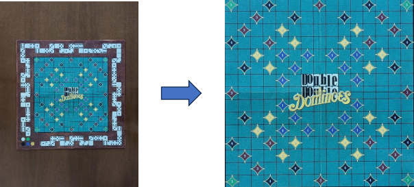
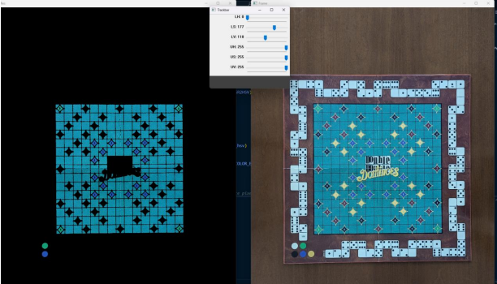
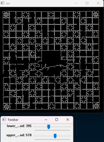
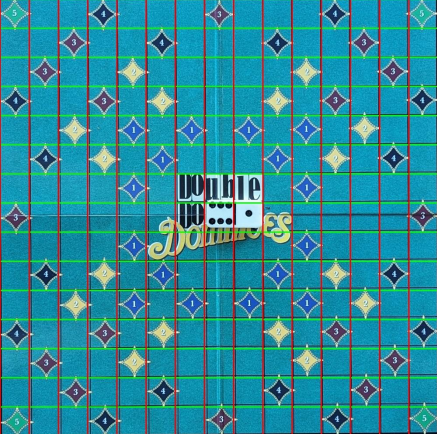
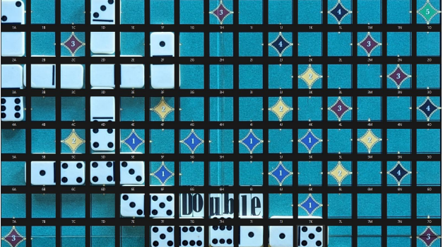

# Double Double Dominoes Score Calculator

## Disclaimer

This project is a Computer Vision class assignment. The implementation presented here is a combination of my own ideas and techniques learned in the class. I acknowledge that this may not be the most optimal approach, and I am open to constructive feedback.

Please feel free to contact me if you have any suggestions.
## Project Overview

The goal of this project is to create an automated scoring system for a variant of the Double Double Dominoes game. To achieve this objective, the project is structured around three key steps:

1. **Identifying Domino Placement:**
   - Determine the specific positions for placing domino tiles in each round.

2. **Classifying Domino Tiles:**
   - Categorize domino tiles based on their unique attributes.

3. **Calculating the Score:**
   - Compute the overall score by leveraging both the domino tiles and the game board.

## 2. Identifying Moves

To identify moves, the first step taken was extracting the game board from the image

  

### Highlighting Game Board using HSV Mask

With the assistance of auxiliary_scripts/filter_colors.py, it can be observed that the game board can be highlighted using an HSV mask with a specific combination of parameters.

  

## Edge Detection and Image Cropping

After applying the mask, the image is converted to grayscale. The next step involves edge detection using the `cv.Canny()` function. However, a problem arose with colored circles in the bottom-left corner. The ultimate goal of edge detection was to find the coordinates of extreme pixels determining the corners of the main game board. Unfortunately, the detected edges around the colored circles interfered with the desired results.

### Issue Resolution

To address this problem, an imperfect cropping of the image around the game board was implemented in auxiliary_scripts/extract_patch_onclick.py, excluding the colored circles.

Following the image cropping, we searched and fine-tuned the Canny parameters using the menu provided by our function. The goal was to ensure that the resulting image contains the edges of interest, specifically those along the edges of the game board.

  

## Corner Detection and Image Transformation

To determine the corners of the game board, the resulting image after applying the Canny function was analyzed to find the most extreme white pixels. Upon locating these pixels, the image was cropped and centered using the `cv.getPerspectiveTransform()` and `cv.warpPerspective()` functions, achieving the initially desired result.

## Extracting Game Board Tiles

After extracting the game board, the next step was to extract tiles corresponding to individual game squares and map them to their positions on the board. The image with the extracted game board is of size (2250 + 2 x padding) x (2250 + 2 x padding), where the padding is always a value divisible by 15. The division of the tiles was achieved by drawing parallel lines along the X and Y axes at intervals of (150 + padding / 15) pixels.

  

The result is a data structure the stores the position on the board and the pixel coodrinates for each tile on the board

  

## Classifying Game Squares

Following the transformations applied to the input image, the problem has been reduced to identifying circles within each square on the board. This leads to a binary classification of the tiles: tiles containing a domino different from the empty domino and tiles containing empty dominoes or tiles that are unoccupied.

## Detecting non-empty dominoes
Circles were identified by using `cv.HoughCircles()`. To make the detection more robust, each valid circle was tested to have the mean color inside the area that it defines closer to 0. The number of circles tells us which domino piece is located on the board.

## Distinguishing between empty tiles and empty dominoes

The main idea involves extracting a patch from the center of the tile and calculating the average pixel value within it. Empty domino pieces are entirely white, resulting in a high average pixel value. This average was utilized as a threshold in the separation of the two possible cases.

## Score calculation and domino placement

The score was calculated following the rules described below:

The scoring path occupies the edge of the game board. Whenever a player scores points, they must immediately move their pawn on the path a number of squares equal to the obtained points. Points can be acquired through two methods:

1. **Placing Domino on Special Squares:**
   - Placing a domino on the special squares (those containing colored diamonds with associated points) on the board.
   - When a player places a domino covering a special square, they earn the indicated points from the diamond. If a player plays a double domino, they receive double the points.

2. **Placing Domino with Matching End Value on Scoring Path:**
   - Placing a domino whose end value matches the value on one of the two ends of the scoring path.
   - Each time a domino is placed on the board, and one of its numbers matches the number on the scoring path square where a pawn is located, the player with that pawn receives a bonus of 3 points. For example, if the pawn is on a square with the value 4, and a domino with one end inscribed with the number 4 is played, the corresponding pawn advances 3 squares.
   - Bonus points are awarded only once for each played domino.

Points are tracked as players place dominoes and advance their pawns on the scoring path.

### Scoring Mechanism Implementation

To facilitate the scoring mechanism, a dictionary was used to mark the positions of special tiles on the board and their associated values. This approach was possible due to the fact that the board is always the same. Another dictionary was used to track the dominoes corresponding to each player's position on the scoring path along the edge of the board. A dedicated function handled all cases outlined in the rules.
